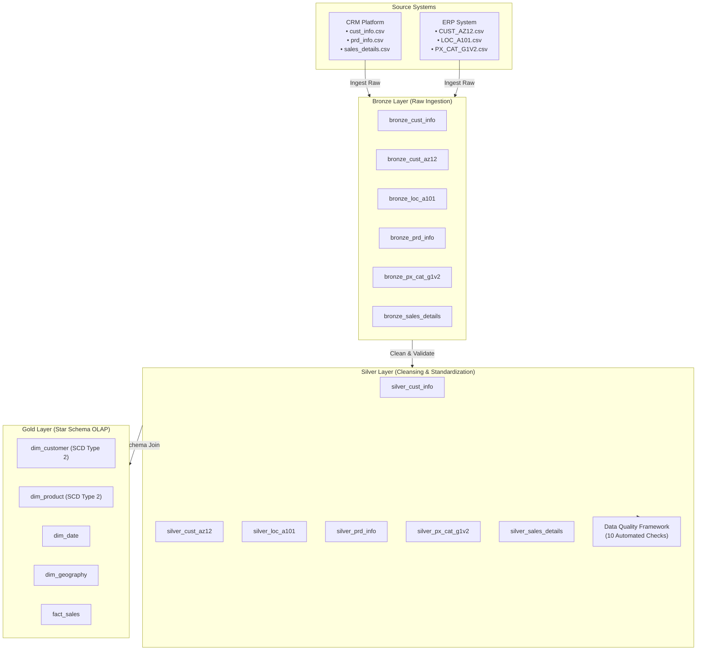
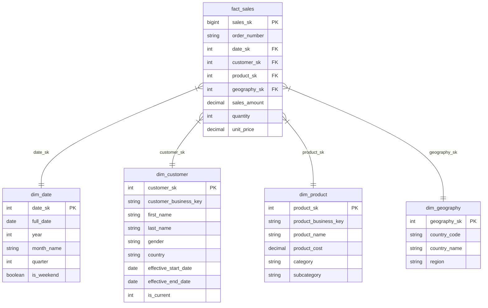

# Retail Data Modeling & Medallion Architecture Platform

[](https://www.python.org/)
[](https://duckdb.org/)
[](#architecture)
[](#testing)

A complete, production-grade **Retail Data Platform** implementing a **Medallion Architecture (Bronze → Silver → Gold)** and an analytics-ready **Star Schema** using Python, DuckDB, ANSI SQL, SQLAlchemy, and Pytest.

---

## 1. Problem Statement & Objectives

A global retail organization operated across fragmented CRM and ERP legacy systems, resulting in disjointed transactional data, missing customer demographics, inconsistent country codes, and calculation discrepancies in sales records.

This project delivers an automated end-to-end data pipeline that:
- **Ingests** raw CRM and ERP datasets into **Bronze** with full audit metadata.
- **Cleanses & Standardizes** raw data in **Silver** by removing duplicates, fixing date anomalies, standardizing categorical attributes, and validating financial formulas.
- **Transforms** clean data into an analytics-ready **Star Schema** in **Gold** with surrogate keys and **Slowly Changing Dimensions (SCD Type 2)**.
- **Enforces** a comprehensive automated **Data Quality Framework**.
- **Delivers** high-performance SQL analytical queries for business intelligence.

---

## 2. System Architecture



---

## 3. Gold Layer Star Schema



---

## 4. Slowly Changing Dimensions (SCD Type 2)

The system implements **SCD Type 2** for historical change tracking on `dim_customer` and `dim_product`. 

When a customer attribute changes (e.g. customer `AW00011000` updates residence from *Australia* to *Canada*):
1. The existing active record is expired: `effective_end_date = CURRENT_DATE` and `is_current = 0`.
2. A new version record is inserted with a new surrogate key `customer_sk`, `effective_start_date = CURRENT_DATE`, `effective_end_date = '9999-12-31'`, and `is_current = 1`.

```text
customer_sk | customer_business_key | country   | effective_start_date | effective_end_date | is_current
------------|-----------------------|-----------|----------------------|--------------------+-----------
1           | AW00011000            | Australia | 2025-10-06           | 2026-08-11         | 0
18485       | AW00011000            | Canada    | 2026-08-11           | 9999-12-31         | 1
```

---

## 5. Data Quality Framework

Every pipeline execution automatically runs 10 automated quality checks covering **Completeness**, **Uniqueness**, **Validity**, **Consistency**, and **Referential Integrity**.

| Check Category | Check Target | Total | Failed | Failure % | Status |
|---|---|---|---|---|---|
| **Completeness** | `silver_cust_info.cst_key` | 18,484 | 0 | 0.0% | **PASSED** |
| **Completeness** | `silver_prd_info.prd_key` | 397 | 0 | 0.0% | **PASSED** |
| **Completeness** | `silver_sales_details.sls_ord_num` | 60,379 | 0 | 0.0% | **PASSED** |
| **Uniqueness** | `silver_cust_info.cst_key` | 18,484 | 0 | 0.0% | **PASSED** |
| **Uniqueness** | `silver_px_cat_g1v2.id` | 37 | 0 | 0.0% | **PASSED** |
| **Validity** | `silver_sales_details.sls_price` | 60,379 | 0 | 0.0% | **PASSED** |
| **Consistency** | `sales_amount = qty * price` | 60,379 | 0 | 0.0% | **PASSED** |
| **Referential Integrity** | `Sales -> Customer FK` | 60,379 | 0 | 0.0% | **PASSED** |
| **Referential Integrity** | `Sales -> Product FK` | 60,379 | 0 | 0.0% | **PASSED** |

---

## 6. Project Layout

```text
retail-medallion-data-platform/
├── data/
│   ├── raw/
│   │   ├── source_crm/            # cust_info.csv, prd_info.csv, sales_details.csv
│   │   └── source_erp/            # CUST_AZ12.csv, LOC_A101.csv, PX_CAT_G1V2.csv
│   └── database/                  # DuckDB database file (retail_medallion.db)
├── src/
│   ├── config/settings.py         # Directory & file settings
│   ├── ingestion/bronze_loader.py # Bronze raw loading with SHA-256 hashes
│   ├── silver/silver_transformer.py # Cleaning & standardization engine
│   ├── gold/gold_transformer.py   # Star Schema builder
│   ├── gold/scd_handler.py        # SCD Type 2 update handler
│   ├── quality/quality_checker.py # Data Quality Framework engine
│   ├── utils/logger.py            # Structured logging
│   └── main.py                    # Master pipeline orchestrator
├── sql/
│   ├── bronze/01_create_bronze.sql
│   ├── silver/02_create_silver.sql
│   ├── gold/03_create_gold.sql
│   ├── scd/04_scd.sql
│   ├── indexes/05_indexes.sql
│   ├── quality/06_quality_checks.sql
│   └── analytics/07_analytics.sql
├── tests/
│   ├── test_bronze.py
│   ├── test_silver.py
│   ├── test_gold.py
│   ├── test_quality.py
│   └── test_scd.py
├── docs/
│   ├── architecture.md
│   ├── star_schema.md
│   ├── data_dictionary.md
│   ├── data_lineage.md
│   └── data_quality.md
├── requirements.txt
├── .gitignore
└── README.md
```

---

## 7. How to Setup & Run

### Prerequisites
- Python 3.9+ installed on MacOS / Linux / Windows.

### 1. Installation
```bash
# Clone repository
git clone https://github.com/your-username/retail-medallion-data-platform.git
cd retail-medallion-data-platform

# Create virtual environment
python3 -m venv .venv
source .venv/bin/activate  # On Windows: .venv\Scripts\activate

# Install dependencies
pip install -r requirements.txt
```

### 2. Execute Master Data Pipeline
```bash
python src/main.py
```

### 3. Run Automated Pytest Suite
```bash
pytest -v
```

---

## 8. Analytical Findings & Business Results

- **Total Transactions**: 61,365 order line items across 27,657 unique sales orders.
- **Total Gross Revenue**: **$29,658,500** USD.
- **Average Order Value (AOV)**: **$1,072.37** USD.
- **Top Product Category**: *Bikes / Road Bikes* generating **$14.81M** revenue, followed by *Mountain Bikes* at **$9.95M**.
- **Top Accessory by Unit Sales**: *Tires and Tubes* with 17,376 units sold.
