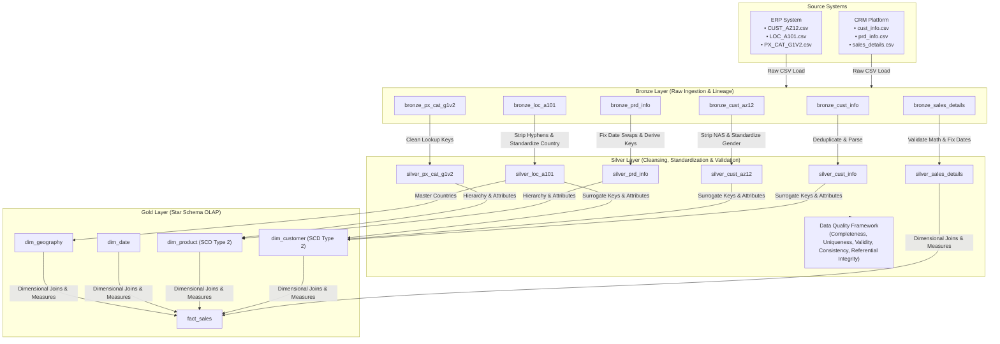

# Retail Data Platform Architecture

## Executive Overview

This document outlines the architectural blueprint of the **Retail Data Platform**, built on a modern **Medallion Architecture (Bronze → Silver → Gold)**. The system ingests fragmented, inconsistent transactional and demographic records from CRM and ERP legacy systems, cleanses and standardizes them, and builds an OLAP analytics-ready **Star Schema** optimized for business intelligence, data quality auditing, and historical change tracking (SCD Type 2).

---

## 1. High-Level System Architecture Diagram

---

## 2. Medallion Layer Specifications

### Bronze Layer (Raw Storage)
- **Purpose**: Preserves raw source records in their original state for lineage, auditing, and re-processing.
- **Key Characteristics**:
  - No business transformation applied.
  - Columns stored as raw text (`VARCHAR`).
  - Audit columns appended: `source_file`, `ingestion_timestamp`, `batch_id`, `record_hash` (SHA-256).

### Silver Layer (Cleansed & Standardized)
- **Purpose**: Serves as the single source of truth for clean, standardized, and validated business entities.
- **Key Transformations**:
  - **Whitespace Trimming**: Stripped leading and trailing spaces across strings.
  - **Identifier Normalization**:
    - Removed prefix `'NAS'` from ERP Customer IDs (`NASAW00011000` → `AW00011000`).
    - Removed hyphens from ERP Location CIDs (`AW-00011000` → `AW00011000`).
  - **Categorical Standardization**:
    - Gender normalized to `'Male'`, `'Female'`, `'N/A'`.
    - Country names unified (`'US'`, `'USA'`, `'United States'` → `'United States'`; `'DE'`, `'Germany'` → `'Germany'`).
    - Product lines mapped (`'R'` → `'Road'`, `'M'` → `'Mountain'`, `'T'` → `'Touring'`, `'S'` → `'Standard'`).
  - **Date Anomaly Fixing**:
    - Swapped product date records exhibiting `prd_start_dt > prd_end_dt`.
    - Parsed integer YYYYMMDD sales dates into proper ANSI `DATE` objects.
  - **Financial Validation Rules**:
    - Corrected negative prices to positive values (`ABS(unit_price)`).
    - Enforced formula consistency: `sales_amount = quantity * unit_price`.
    - Inferred missing price when sales amount and quantity were present.

### Gold Layer (Dimensional Star Schema)
- **Purpose**: Optimized for high-speed analytical queries, BI tools (Power BI, Tableau), and executive reporting.
- **Key Characteristics**:
  - **Surrogate Keys**: Integer surrogate primary keys (`customer_sk`, `product_sk`, `date_sk`, `geography_sk`, `sales_sk`).
  - **SCD Type 2**: Supports historical change tracking on `dim_customer` and `dim_product` using `effective_start_date`, `effective_end_date`, and `is_current` flags.
  - **Conformed Dimensions**: Shared date and geography dimensions.

---

## 3. Technology Stack & Rationale

| Component | Technology | Rationale |
|---|---|---|
| **Database Engine** | **DuckDB** | In-process columnar OLAP database providing fast vector execution, ANSI SQL compliance, window functions, and zero-server setup overhead. |
| **ETL Orchestration** | **Python 3.9+** | Modular object-oriented architecture (`BronzeLoader`, `SilverTransformer`, `GoldTransformer`, `QualityChecker`, `SCDHandler`). |
| **SQL Dialect** | **ANSI SQL** | Clean, portable DDL/DML scripts organized into modular `.sql` files. |
| **Testing** | **Pytest** | Automated unit and integration testing covering data transformations, quality metrics, and surrogate key integrity. |
| **Formatting & Logging**| **Tabulate & Logging**| Professional CLI tables and structured file logging. |
