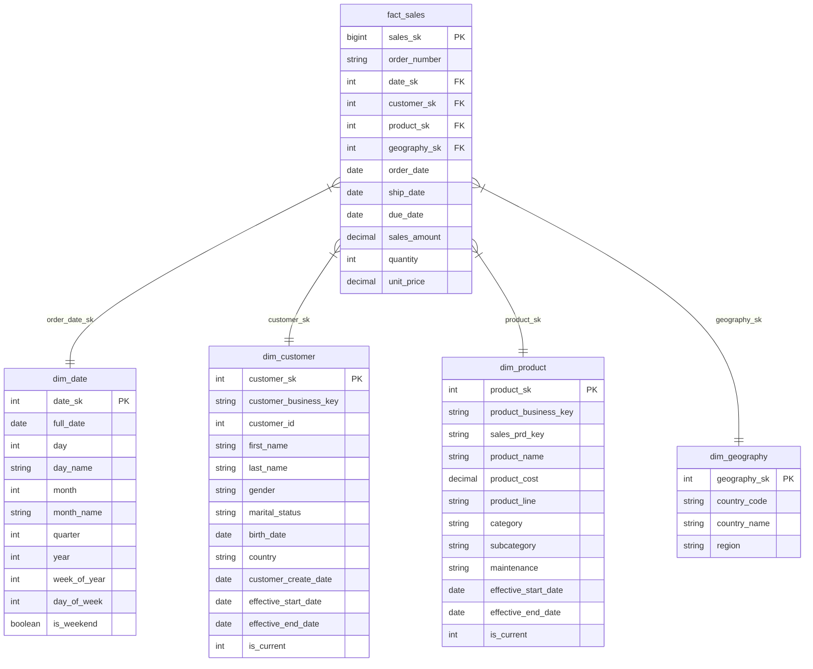

# Star Schema Specification

## Overview

The Gold Layer is structured as an analytics-ready **Star Schema** optimized for high-performance OLAP aggregations, time-series reporting, and BI tool integration.

---

## Star Schema Diagram

---

## 1. Fact Table Specification

### `fact_sales`
- **Granularity**: One record per sales order line item transaction.
- **Total Records**: 61,365 rows.
- **Measures**:
  - `sales_amount` (NUMERIC(12,2)): Total monetary transaction value.
  - `quantity` (INTEGER): Units purchased.
  - `unit_price` (NUMERIC(10,2)): Unit price per item.

| Column Name | Data Type | Key Type | Nullable | Description |
|---|---|---|---|---|
| `sales_sk` | BIGINT | PK | No | Unique surrogate primary key |
| `order_number` | VARCHAR | Degenerate | No | Sales order number (e.g. `SO43697`) |
| `date_sk` | INT | FK | No | Foreign key to `dim_date.date_sk` |
| `customer_sk` | INT | FK | No | Foreign key to `dim_customer.customer_sk` |
| `product_sk` | INT | FK | No | Foreign key to `dim_product.product_sk` |
| `geography_sk` | INT | FK | No | Foreign key to `dim_geography.geography_sk` |
| `order_date` | DATE | Attribute | No | Transaction order date |
| `ship_date` | DATE | Attribute | Yes | Order shipment date |
| `due_date` | DATE | Attribute | Yes | Payment due date |
| `sales_amount` | NUMERIC(12,2) | Measure | No | Net sales revenue ($) |
| `quantity` | INT | Measure | No | Units sold |
| `unit_price` | NUMERIC(10,2) | Measure | No | Unit price ($) |

---

## 2. Dimension Tables Specification

### `dim_customer` (SCD Type 2)
- **Surrogate Key**: `customer_sk`
- **Business Key**: `customer_business_key` (`cst_key` e.g., `AW00011000`)
- **Total Records**: 18,485 rows (plus historical versions)

| Column Name | Data Type | Key Type | Description |
|---|---|---|---|
| `customer_sk` | INT | PK | Surrogate primary key |
| `customer_business_key` | VARCHAR | Business Key | Standardized customer code (`AW00011000`) |
| `customer_id` | INT | Alternate Key | CRM numeric ID (`11000`) |
| `first_name` | VARCHAR | Attribute | Customer first name |
| `last_name` | VARCHAR | Attribute | Customer last name |
| `gender` | VARCHAR | Attribute | Standardized gender (`Male`, `Female`, `N/A`) |
| `marital_status` | VARCHAR | Attribute | Standardized marital status (`Married`, `Single`, `N/A`) |
| `birth_date` | DATE | Attribute | Customer date of birth (from ERP) |
| `country` | VARCHAR | Attribute | Residence country (from ERP location) |
| `customer_create_date` | DATE | Attribute | Account registration date |
| `effective_start_date` | DATE | SCD Meta | Version start date |
| `effective_end_date` | DATE | SCD Meta | Version end date (default `9999-12-31`) |
| `is_current` | INT | SCD Meta | Current record indicator (`1` = Current, `0` = Historical) |

### `dim_product` (SCD Type 2)
- **Surrogate Key**: `product_sk`
- **Business Key**: `product_business_key` (`prd_key` e.g. `BI-RB-BK-R93R-62`)

| Column Name | Data Type | Key Type | Description |
|---|---|---|---|
| `product_sk` | INT | PK | Surrogate primary key |
| `product_business_key` | VARCHAR | Business Key | Full product key (`BI-RB-BK-R93R-62`) |
| `sales_prd_key` | VARCHAR | Join Key | Sales lookup key suffix (`BK-R93R-62`) |
| `product_name` | VARCHAR | Attribute | Product description |
| `product_cost` | NUMERIC(10,2) | Attribute | Unit manufacturing cost ($) |
| `product_line` | VARCHAR | Attribute | Line (`Road`, `Mountain`, `Touring`, `Standard`) |
| `category` | VARCHAR | Attribute | Product category (from ERP lookup) |
| `subcategory` | VARCHAR | Attribute | Subcategory (from ERP lookup) |
| `maintenance` | VARCHAR | Attribute | Maintenance flag (`Yes`/`No`) |
| `effective_start_date` | DATE | SCD Meta | Effective start date |
| `effective_end_date` | DATE | SCD Meta | Effective end date |
| `is_current` | INT | SCD Meta | Current record flag |

### `dim_date`
- **Surrogate Key**: `date_sk` (Format `YYYYMMDD`)
- **Span**: 2010-01-01 to 2015-12-31 (2,191 rows)

### `dim_geography`
- **Surrogate Key**: `geography_sk`
- **Total Records**: 8 rows (Master countries + `N/A`)

---

## 3. Rationale for Modeling Decisions

1. **Surrogate Keys**: Integer surrogate keys decouple the warehouse from source system changes, support SCD Type 2 multi-versioning, and optimize join execution speed.
2. **Geography Dimension Separation**: Separating country attributes into `dim_geography` allows flexible spatial slice-and-dice, hierarchy management (Region → Country), and standardized international reporting.
3. **Date Dimension Pre-population**: Pre-building `dim_date` ensures gapless time-series reporting for month-over-month growth, quarterly trends, and weekend filtering.
